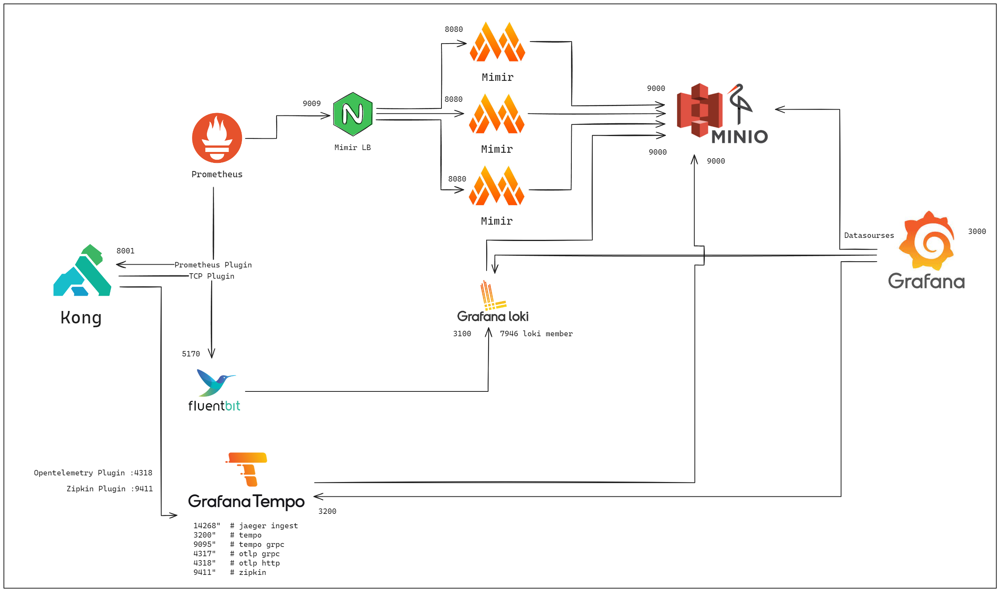

# Kong + LGTM Stack

## Diagram


## Deploy.
```
docker compose up -d kong-database
docker compose run --rm kong kong migrations
docker compose up -d kong
mkdir -p tempo-data && chown -R 10001:10001 tempo-data
docker compose up -d
```

## Add Kong Plugins.

### 1. Add Services and Route
```
curl -i -s -X POST http://localhost:8001/services \
  --data name=httpbin \
  --data url='http://httpbin'

curl -i -X POST http://localhost:8001/services/httpbin/routes \
  --data 'paths[]=/' \
  --data name=httpbin_route
```

### 2. Add Plugins
```
curl -X POST http://localhost:8001/plugins \
    --data "name=zipkin"  \
    --data "config.http_endpoint=http://tempo:9411"  \
    --data "config.sample_ratio=1"  \
    --data "config.local_service_name=kong-zipkin \
    --data "config.include_credential=true"


curl -X POST http://localhost:8001/plugins \
    --data "name=opentelemetry"  \
    --data "config.endpoint=http://tempo:4318/v1/traces"  


curl -X POST http://localhost:8001/plugins \
    --data "name=prometheus"  \
    --data "config.per_consumer=false"


curl -X POST http://localhost:8001/plugins \
    --data "name=tcp-log"  \
    --data "config.host=fluentbit"  \
    --data "config.port=5170"

```
